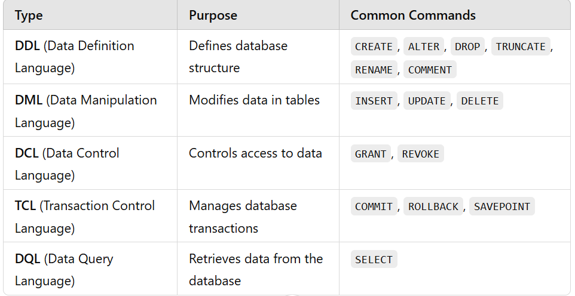

# Definition

**SQL (Structured Query Language) is a standard programming language used to manage and manipulate relational databases. It is used to CRUD data in databases. SQL is essential for working with RDBMS such as MySQL, PostgreSQL, SQL Server, and Oracle.**

## Different types of SQL commands
